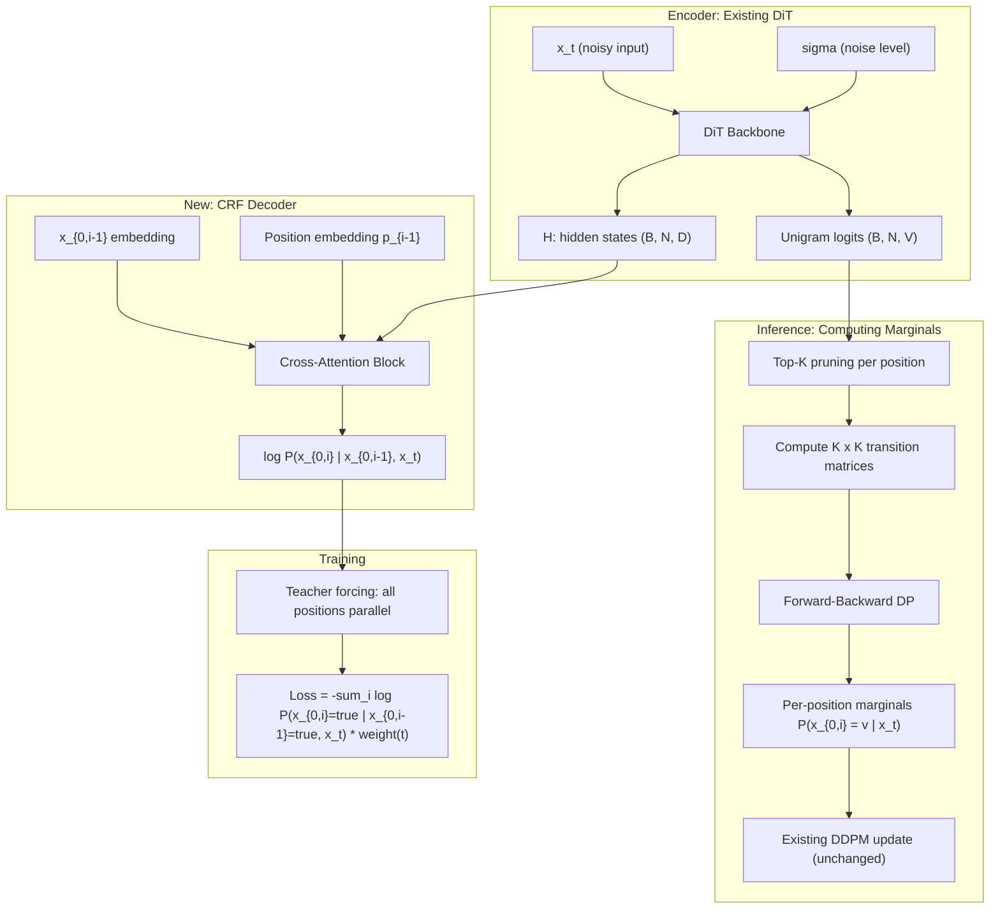

# CRF-MDLM: First-Order CRF Denoising for Masked Discrete Diffusion

## 1. Problem and Motivation

The current MDLM model in [diffusion.py](diffusion.py) parameterizes the denoising distribution as a fully factorized product:

```
P_theta(x_0 | x_t) = prod_i P_theta(x_{0,i} | x_t)
```

This is implemented in `_subs_parameterization` (line 261-277) where each position independently outputs logits over the vocabulary. The backbone DiT ([models/dit.py](models/dit.py), line 359-370) produces `(batch, seq_len, vocab_size)` logits — one independent distribution per position.

**The core issue**: when multiple masked positions are unmasked simultaneously in a single denoising step (e.g., in `_ddpm_update` at line 612-637), their predictions are sampled independently. Adjacent positions with similar context tend to produce similar distributions, leading to token repetitions that wouldn't occur in autoregressive generation.

## 2. Proposed Solution: First-Order CRF Denoising

Replace the factorized distribution with a first-order chain:

```
P_theta(x_0 | x_t) = prod_i P_theta(x_{0,i} | x_{0,i-1}, x_t)
```

This is a locally-normalized first-order CRF (equivalently, an autoregressive chain conditioned on x_t). Adjacent token dependencies prevent repetition while still allowing parallel training via teacher forcing.

### Architecture Overview




### Key Interface with Existing Code

The CRF model's output integrates with the existing diffusion framework at exactly one point: it produces per-position marginals `P(x_{0,i} = v | x_t)` of shape `(batch, seq_len, vocab_size)` — the same shape as the current model output. The DDPM update code in `_ddpm_update` / `_ddpm_caching_update` remains **unchanged**. Only:

1. **Training**: how `log P_theta(x_0 | x_t)` is computed (CRF chain vs independent)
2. **Inference**: how per-position probabilities are produced (forward-backward vs direct softmax)

## 3. Implementation Plan

### Phase 0: Scaffold and Configuration

- Add new config options: `backbone: crf_dit`, plus CRF-specific params (`crf.decoder_layers`, `crf.decoder_heads`, `crf.top_k`, `crf.decoder_dim`)
- Create config files: `configs/model/small-crf.yaml`
- Add `parameterization: crf_subs` option in [diffusion.py](diffusion.py)

### Phase 1: CRF Decoder Module

Create `models/crf_decoder.py` containing:

**a) `CRFDecoder` module**:

- Input: a token index `x_{i-1}` and position `i-1`, plus encoder hidden states `H`
- Architecture: token embedding + positional embedding -> cross-attention to H -> FFN -> output logits over V
- During training: batched over all N positions (teacher forcing), input is shifted `x_0` 
- Output: `(batch, seq_len, vocab_size)` log-probabilities `log P(x_{0,i} | x_{0,i-1}, x_t)`

**b) `CRFDiT` wrapper module** (new backbone):

- Contains the existing DiT encoder (reuse `DDiTBlock` stack) + the new CRF decoder
- Encoder forward: `x_t, sigma -> H, unigram_logits`
- Decoder forward (training): `H, x_0_shifted -> transition_logprobs`
- Decoder forward (inference): `H, candidate_tokens -> transition_matrices`

### Phase 2: Training Loss

Modify [diffusion.py](diffusion.py) to support the CRF parameterization:

**a) New `_crf_subs_parameterization` method**:

- Calls the CRF decoder with teacher forcing
- For unmasked positions in x_t: same as current SUBS (copy through, log prob = 0)
- For masked positions: use CRF transition probabilities
- Returns per-position `log P(x_{0,i} | x_{0,i-1}, x_t)`

**b) Modified `_forward_pass_diffusion**`:

- For CRF parameterization, the loss computation is:
  ```python
  # log_p_theta shape: (batch, seq_len) - per-position log probs from CRF
  log_p_theta = crf_log_probs(model_output, x0)
  loss = -log_p_theta * (dsigma / expm1(sigma))[:, None]
  ```
- The noise weighting is the same; only the source of `log_p_theta` changes.

### Phase 3: Forward-Backward for Inference Marginals

Create `crf_utils.py` with:

**a) `top_k_filter(unigram_logits, K)**`: 

- For each position, select top-K token candidates from unigram logits
- Returns `(batch, seq_len, K)` indices and logits

**b) `compute_transition_matrices(decoder, H, top_k_indices, K)**`:

- For each position i and each of K candidates at position i-1, run the decoder
- Produces `(batch, seq_len, K, K)` transition log-probabilities
- Batched: reshape to `(batch * seq_len * K, 1)` decoder calls, or more efficiently, `(batch, seq_len * K, ...)` with position info

**c) `forward_backward(transition_logprobs, K)**`:

- Forward pass: `alpha[i, v] = logsumexp_u(alpha[i-1, u] + T[i, u, v])`
- Backward pass: `beta[i, v] = logsumexp_w(T[i+1, v, w] + beta[i+1, w])`
- Marginals: `P(x_{0,i} = v) = softmax(alpha[i, v] + beta[i, v])`
- All in log-space for numerical stability
- O(N * K^2) complexity, fully differentiable if needed

**d) `crf_marginals_to_full(marginals, top_k_indices, vocab_size)**`:

- Scatter the K-dimensional marginals back into full V-dimensional vectors
- Returns `(batch, seq_len, vocab_size)` — same shape as current model output

**Integration**: In `_ddpm_update` and `_ddpm_caching_update`, replace:

```python
p_x0 = self.forward(x, sigma_t).exp()  # current: independent
```

with:

```python
p_x0 = self.forward_crf_marginals(x, sigma_t)  # new: CRF marginals
```

### Phase 4: Overfitting Experiment (Proof of Concept)

Before scaling up, validate correctness:

- Take 32 training examples from OpenWebText or text8
- Train the CRF-MDLM until training perplexity decreases and the model memorizes the data
- Verify: (a) loss goes down, (b) generated samples look reasonable, (c) no NaN issues
- Compare repetition rates vs baseline MDLM on these 32 examples

### Phase 5: Full-Scale Training and Experiments

**Datasets**: text8 (character-level, simpler), OpenWebText (token-level, main result)

**Baselines**:

- MDLM (original, independent factorization)
- Autoregressive baseline (existing in codebase)
- Ablation: CRF with different K values (32, 64, 128, 256)

**Metrics**:

- Perplexity (validation NLL)
- Generative perplexity (using GPT-2 large, existing in codebase at line 515-573)
- Token repetition rate (new metric: fraction of consecutive duplicate tokens)
- n-gram diversity / Self-BLEU
- Wall-clock time per sample vs quality tradeoff

**Key Experiments for Paper**:

1. **Main result table**: PPL and Gen-PPL on text8 + OpenWebText, CRF-MDLM vs MDLM vs AR
2. **Repetition analysis**: Show CRF reduces consecutive token repetitions quantitatively
3. **Qualitative samples**: Side-by-side generated text showing repetition artifacts in MDLM vs clean CRF-MDLM output
4. **Ablation on K**: How top-K pruning affects quality and speed
5. **Number of denoising steps**: CRF-MDLM may need fewer steps since each step is higher quality
6. **Decoder architecture ablation**: 1 vs 2 vs 4 cross-attention layers in the CRF decoder
7. **Speed analysis**: Training time overhead (minimal, since teacher forcing is parallel) and inference time overhead (forward-backward cost)

### Phase 6: Extensions (Stretch Goals)

- **Full CRF with partition function Z**: Train with `log Z` computed via forward algorithm. More principled but harder to train. Compare with locally-normalized version.
- **Higher-order CRF**: Second-order dependencies `P(x_i | x_{i-1}, x_{i-2})` for even stronger coherence.
- **Conditional generation**: Use CRF-MDLM for infilling, where some positions are given and the model fills in the rest with coherent adjacent tokens.

## 4. Key Technical Decisions


| Decision             | Choice                                    | Rationale                                                                     |
| -------------------- | ----------------------------------------- | ----------------------------------------------------------------------------- |
| CRF variant          | Locally normalized (autoregressive chain) | Simpler training (no partition function), parallelizable with teacher forcing |
| Decoder architecture | 1-2 cross-attention blocks                | Lightweight; encoder does heavy lifting                                       |
| Inference            | Top-K pruning + forward-backward          | O(NK^2) is tractable; K=64-128 balances speed/quality                         |
| Encoder              | Reuse existing DiT                        | Leverage pretrained weights; encoder quality is well-validated                |


## 5. File Changes Summary

- **New files**: `models/crf_decoder.py`, `crf_utils.py`, `configs/model/small-crf.yaml`
- **Modified files**: [diffusion.py](diffusion.py) (new parameterization, modified forward/sampling), [main.py](main.py) (minor config routing), `models/__init__.py` (import)
- **Unchanged**: [noise_schedule.py](noise_schedule.py), [models/dit.py](models/dit.py) (encoder reused as-is), [dataloader.py](dataloader.py), existing configs

